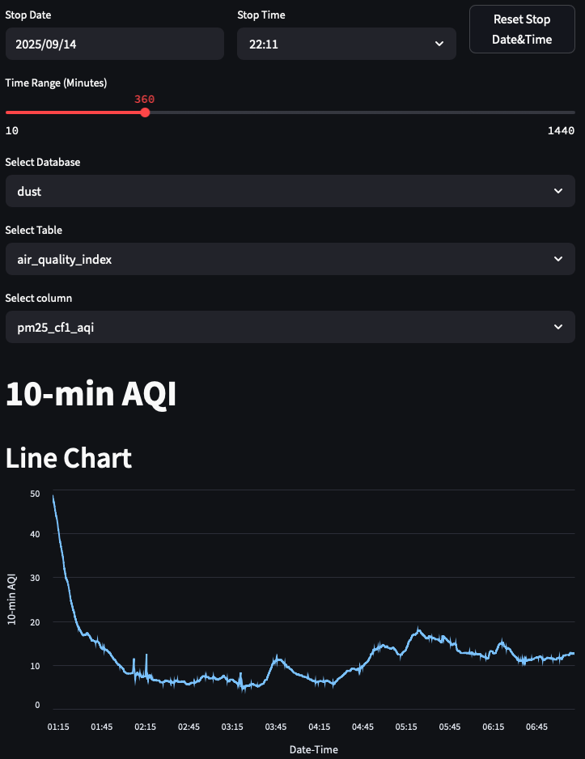

# Air Quality Data Analysis

This script is intended for historical AQ data analysis provided by [aq_dashboard](https://github.com/cristeab/aq_dashboard) project.
Prepare the Python virtual environment:

```bash
    python3 -m venv .venv
    source .venv/bin/activate
    pip install -r requirements.txt
```

Set INFLUX_TOKEN environment variable, then run the script

```bash
    export INFLUX_TOKEN="<token>"
    streamlit run ./aq_data_analysis.py
```

A browser tab should be automatically open.


